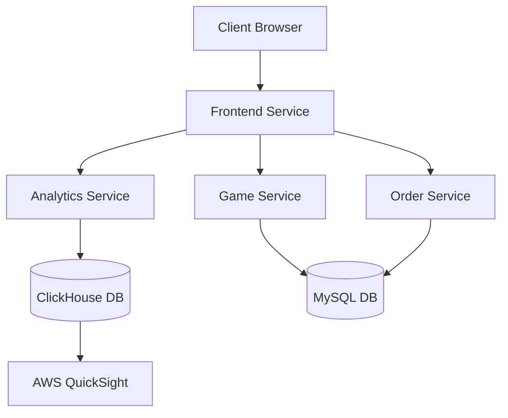
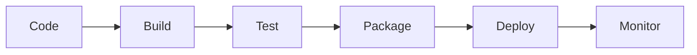

# Lugx Gaming Platform Implementation Report

## Executive Summary
The Lugx Gaming Platform is a modern e-commerce solution for digital games, featuring microservices architecture, real-time analytics, automated deployments, and comprehensive monitoring. This report details the implementation, architecture, security considerations, and deployment procedures.

## 1. Solution Architecture

### 1.1 System Overview
The platform consists of four main microservices:
- Frontend Service (Nginx)
- Game Service (Node.js)
- Order Service (Node.js)
- Analytics Service (Node.js with ClickHouse)

### 1.2 Architecture Diagram


### 1.3 Data Flow Description
1. User Interactions:
   - Frontend captures user events (clicks, page views, scroll depth)
   - Events sent to Analytics Service
   - Data stored in ClickHouse for analysis

2. Game Management:
   - Game catalog stored in MySQL
   - CRUD operations via Game Service
   - Real-time inventory updates

3. Order Processing:
   - Orders handled by Order Service
   - Transaction data in MySQL
   - Analytics events for purchases

4. Analytics Pipeline:
   - Real-time event processing
   - ClickHouse for data warehousing
   - QuickSight for visualization

## 2. Security and Ethics Challenges

### 2.1 Security Considerations
1. Data Privacy and GDPR:
   - User data encryption
   - Data retention policies
   - Right to be forgotten implementation

2. Infrastructure Security:
   - Kubernetes RBAC
   - Network policies
   - Container security
   - Secret management

3. Application Security:
   - API authentication
   - Input validation
   - XSS prevention
   - CSRF protection

### 2.2 Ethical Considerations
1. User Privacy:
   - Transparent data collection
   - Clear privacy policies
   - Data minimization

2. Gaming Ethics:
   - Addiction prevention
   - Age restrictions
   - Content warnings

3. Business Ethics:
   - Fair pricing
   - Clear refund policies
   - Transparent marketing

## 3. CI/CD Implementation

### 3.1 Pipeline Architecture


### 3.2 Pipeline Components
1. Build Phase:
   ```yaml
   build-and-test:
     runs-on: ubuntu-latest
     strategy:
       matrix:
         service: [frontend, analytics-service, game-service, order-service]
     steps:
       - uses: actions/checkout@v3
       - name: Build Docker image
         run: |
           docker build -t ${{ env.REGISTRY }}/${{ github.repository }}/${{ matrix.service }}:${{ github.sha }}
   ```

2. Test Phase:
   ```yaml
   integration-tests:
     needs: deploy
     runs-on: ubuntu-latest
     steps:
       - name: Run integration tests
         run: npm run test:integration
   ```

3. Deployment Phase (Blue-Green):
   ```yaml
   deploy:
     steps:
       - name: Deploy Blue Environment
         run: |
           kubectl apply -f k8s/blue/
           kubectl rollout status deployment/blue
   ```

## 4. Kubernetes Deployment

### 4.1 Service Configurations
Analytics Service:
```yaml
apiVersion: apps/v1
kind: Deployment
metadata:
  name: analytics-service
spec:
  replicas: 3
  strategy:
    type: RollingUpdate
  template:
    spec:
      containers:
        - name: analytics-service
          image: analytics-service:1.0
          resources:
            limits:
              cpu: "500m"
              memory: "512Mi"
```

### 4.2 Monitoring Setup
Prometheus Configuration:
```yaml
scrape_configs:
  - job_name: 'analytics-service'
    kubernetes_sd_configs:
      - role: pod
    relabel_configs:
      - source_labels: [__meta_kubernetes_pod_label_app]
        regex: analytics-service
        action: keep
```

## 5. Analytics Implementation

### 5.1 ClickHouse Configuration
```sql
CREATE TABLE events (
    ts DateTime,
    session_id String,
    event String,
    path String,
    value String
) ENGINE = MergeTree()
ORDER BY ts;
```

### 5.2 AWS QuickSight Integration
1. Data Source Setup:
   ```javascript
   const quicksightClient = new QuickSightClient({
     region: AWS_REGION,
     credentials: {
       accessKeyId: AWS_ACCESS_KEY_ID,
       secretAccessKey: AWS_SECRET_ACCESS_KEY
     }
   });
   ```

2. Dashboard Configuration:
   - Real-time user metrics
   - Game popularity charts
   - Purchase funnel analysis
   - Session duration tracking

## 6. Testing Strategy

### 6.1 Test Suite Implementation
```javascript
describe('Integration Tests', () => {
  test('Complete Purchase Flow', async () => {
    // Create game
    const game = await createGame();
    expect(game.id).toBeDefined();

    // Create order
    const order = await createOrder(game.id);
    expect(order.status).toBe('completed');

    // Verify analytics
    const events = await getAnalyticsEvents();
    expect(events).toContain({
      type: 'purchase',
      gameId: game.id
    });
  });
});
```

## 7. Deployment Runbook

### 7.1 Prerequisites
- Kubernetes cluster
- kubectl configured
- GitHub account
- AWS account with QuickSight
- Slack workspace (for notifications)

### 7.2 Setup Steps
1. Configure GitHub Secrets:
   ```bash
   # Add required secrets
   KUBE_CONFIG=<base64-encoded-kubeconfig>
   AWS_ACCESS_KEY_ID=<your-access-key>
   AWS_SECRET_ACCESS_KEY=<your-secret-key>
   AWS_ACCOUNT_ID=<your-account-id>
   SLACK_WEBHOOK_URL=<your-webhook-url>
   ```

2. Deploy Infrastructure:
   ```bash
   # Deploy services
   kubectl apply -f k8s/monitoring.yaml
   kubectl apply -f k8s/analytics-service.yaml
   kubectl apply -f k8s/game-service.yaml
   kubectl apply -f k8s/order-service.yaml
   kubectl apply -f k8s/frontend.yaml
   ```

3. Verify Deployment:
   ```bash
   # Check service status
   kubectl get pods
   kubectl get services
   ```

### 7.3 Monitoring Access
- Prometheus: http://prometheus:9090
- Grafana: http://grafana:3000
- AWS QuickSight Dashboard

## 8. Conclusion
The Lugx Gaming Platform demonstrates a modern, scalable architecture with:
- Microservices-based design
- Automated deployment pipeline
- Comprehensive monitoring
- Real-time analytics
- Security-first approach

### Future Improvements
1. Enhanced Analytics:
   - Machine learning for game recommendations
   - Predictive analytics for user behavior
   - Advanced fraud detection

2. Infrastructure:
   - Multi-region deployment
   - Automated scaling
   - Disaster recovery improvements

3. Security:
   - Advanced threat detection
   - Enhanced audit logging
   - Automated security testing
